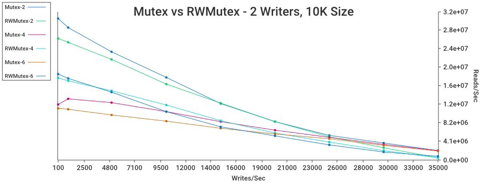
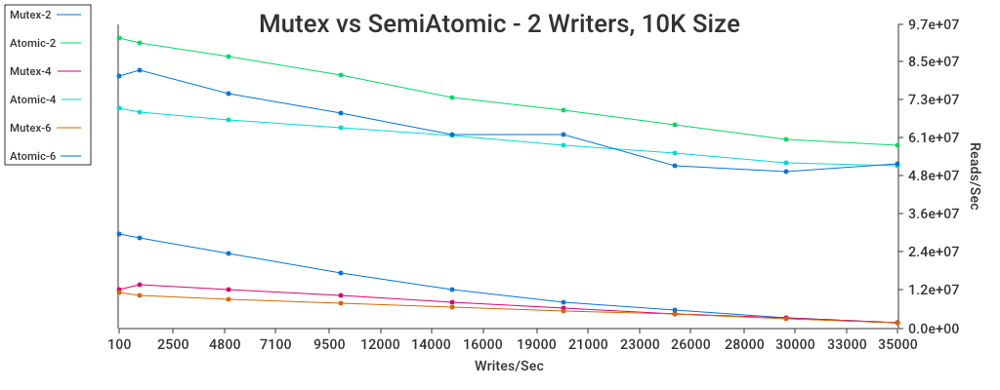

# Benchmarking Some Serialized Data Patterns

I was curious about the performance of some serialization techniques
reads/writes on a Go data structure. What follows is an overview of some
different ways to do this along with some benchmark. Particularly, it highlights
a hybrid atomic/lock structure that can work well in situations with cheap reads
and expensive writes.

A note on the article - this was written in hopes of being understandable to
those with only passing familiarity with multithreading. For those with more
experience, the section on atomics and benchmarking may still prove interesting.


# Background & Setup

A common multi-threading problem: there is some data in your application.
Readers and writers will need to access and modify the data from multiple
threads. If multiple threads just start reading and writing without any care, a
whole host of problems arise. How is this access made to be safe?

I often follow this pattern to guarantee thread safety:

- Treat the data itself as immutable. It can be fetched and updated, but all
  subfields and data structures are never directly.

- Whenever any part of the data needs to be updated, create a complete copy of
  the original with whatever updated values are needed.

- Perform updates and gets within a lock to ensure multiple threads can get
  access. As the data is immutable, simply return a reference and let any
  readonly processing happen outside of the lock.

Of course, there are plenty of situational alterations to this pattern; but it's
a good starting point when dealing with sharing data between threads. For the
sake of this experiment, I'll be using the following toy interface:

```go
// ThreadsafeArray is an interface that represents an integer array of fixed
// length.
type ThreadsafeArray interface {
 	// Get returns the underlying array. Note that this should be treated as
 	// immutable.
 	Get() []int

	// Add increments every value in the array by the given amount.
	Add(amt int)
}
```

This is a comically underpowered interface without real world value. It is
acting as a stand-in for the basic type of concurrency under test here:
immutable shared data, cheap reads, and expensive writes. Expense can be altered
by changing the size of the array.


## Locks

The most common way to deal with this is with a lock (or "mutex"). Here's an
implementation using a plain go mutex:

```go
// MutexArray implements ThreadsafeArray with a single mutex.
type MutexArray struct {
	l sync.Mutex
  a []int
}

func (ma *MutexArray) Get() []int {
  ma.l.Lock()
  v := ma.a
	ma.l.Unlock()
	return v
}

func (ma *MutexArray) Add(amt int) {
	ma.l.Lock()
	newA := make([]int, len(ma.a))
	for i, v := range ma.a {
		newA[i] = v + amt
	}
  ma.a = newA
  ma.l.Unlock()
}
```

This is as simple as it gets. If the data needs to be read or written, a lock is
first required. Anyone else who needs to act on the data will try to acquire the
same lock, and wait until the lock is free before taking action.

A common variant of this is to use a read-write lock rather than just a plain
lock. A read-write lock let's multiple readers access the data at the same time,
but ensures if anyone is writing to the data everyone else has to wait.


## Atomics

Atomics can be used as an alternative to locks. They use special CPU
instructions for writing/reading to avoid the need for a lock. This can avoid
blocking, but at the expense of being more limited. They can only write/read a
few bytes. Caution is needed to ensure correctness of any solution.

Consider (RW)MutexArray - while the writer is preparing an update, no reader can
proceed. The writer isn't modifying any existing data up until the end; most of
the work is spent creating a new version of the data.

Instead of a lock, we could replace the value with an atomic reference. A read
can just get this value reliably with less overhead. A write can first perform
an atomic read, perform any necessary changes on the data copy, then perform an
atomic write.

But: this is too simplistic. What happens if two writes happen at the same time?
They can both make a copy of the same base array, create a derived version, then
perform the write. Since they both were working on the same array, one will
_overwrite_ the other. We need these writes, updates and all, to happen
in-sequence.

If you wish to make it truly lockless, a _compare and swap_ (CAS) can be
used. This will conditionally write the value if it hasn't changed.

1. Atomically read the value
2. Perform the update
3. Compare-and-swap the value with the new one
4. If the swap succeeds; return. Otherwise, go back to 1.

As this experiment specifically is for cases with cheap reads and expensive
writes, CAS operations aren't ideal. If write density gets too high, then you
will have to repeat the write over-and-over before it succeeds.

This experiment includes a hybrid implementation, where the value is atomic but
a lock must be acquired to update the value. This allows reads to always proceed
with zero contention, even during an update, but ensures all updates happen
serially -

```go
type SemiAtomicArray struct {
	updateL sync.Mutex
	v       atomic.Value
}

func (ma *SemiAtomicArray) Get() []int {
	return ma.v.Load().([]int)
}

func (ma *SemiAtomicArray) Add(amt int) {
	ma.updateL.Lock()
	oldA := ma.v.Load().([]int)
	newA := make([]int, len(oldA))
	for i, v := range oldA {
		newA[i] = v + amt
	}
  ma.v.Store(newA)
  ma.updateL.Unlock()
}
```


## Channels?

Go's trademark means of data sharing is passing messages via channels. They're
fine in some situations, but they have a fundamentally more complicated runtime
with a high overhead. These benchmarks are focused on simpler, passive data that
needs to be shared; channels are not considered.


# Benchmarking the Implementations

So, with all that introducing out of the way, let's take a look at how these
perform under different conditions. We'll consider four main variables:

- The size of the array, which is a stand-in for how expensive the update is.

- Number writes per second. If this is high enough, the data will be constantly
  written to.

- The number of reader and writer goroutines. Each goroutine will occasionally
  preempt itself by taking nanosecond sleeps at occasional intervals.

This is being tested on my 2012 mac mini, with a i7-3615QM processor. The
total number of active goroutines is generally limited to 8, as that is the
number of threads.

Without further adieu - let's dive into some benchmarks.


## Plain vs RW Mutex

Let's take a a look at a plain mutex vs a rw mutex. In all tests, there are a
fixed number of two writing goroutines. The number of readers varies from 2-6.
The experiment is conducted with a number of writes per second varying from
100-35,000, and a fixed array size of 10,000.



Overall, as the number of readers increases performance drops. RWMutex better
weathers additional readers, but not very well.

As write frequency increases, the read-write advantage will eventually disappear
and reverse. This is likely due to the mechanics of Go's RWMutex. A write lock
has higher priority than a read lock; it's guaranteed to be serviced before any
read lock. I'd wager that as goroutines spend more and more time inside of or
waiting on the lock mutex, very few parallel read locks can be acquired. That
ruins the advantage of the read lock, and throughput drops on account of the
more complicated mechanics.

Note that these results are specific to having cheap reads and expensive writes.
RWMutex would perhaps fare better if the situation were reversed.


## Defer vs Manual Unlock

Astute Go programmers may have noticed the lack of `defer` in the sample code so
far. Idiomatic Go commonly uses `defer` to handle resource cleanup, which can be
used to guarantee an action is taken before exiting a function.

This was just to squeeze out a little more performance - `defer` can add
noticeable overhead to simple cases. Here's a contrast between a manual unlock
and a defer unlock:


Not too much to see here - defer adds considerable overhead in cases where the
guarded action is so cheap. Still, I'd tend to use it just because it's the most
obviously correct way to guard actions, and makes code more robust to future
changes.

For example, let's say we extend the mutex array to early exit if there's no
work to do:

```go
// fine - the defer is still triggered with the early exit
func (ma *MutexArray) Add(amt int) {
  ma.l.Lock()
  defer ma.l.Unlock()
  if len(ma.a) == 0 || amt == 0 {
    return
  }
  // performs work
}

// deadlock - the early exit makes the array unusable, and brings down the program
func (ma *MutexArray) Add(amt int) {
  ma.l.Lock()
  if len(ma.a) == 0 || amt == 0{
    return
  }
  // performs work
  ma.l.Unlock()
}
```


## Mutex vs Hybrid Atomic

Let's take a look at the partially atomic implementation -



That's a pretty big jump in read performance! Removing the lock drastically
reduces the cost of a read across many load profiles.

This is less obvious from the graph, but write performance is also somewhat
helped, as there's less contention for the lock.

Interestingly, read performance still drops some when the total number of
goroutines goes beyond 4. That would deserve some more investigation - it might
just be a limit of atomic instructions on the processor, or perhaps the
underlying 4 cores of the processor aren't able to squeeze out any more
performance even with eight threads.

# Conclusions

In sum: in basic cases that don't involve huge amounts of contention, a basic
lock will do fine. Correctness is always a more pressing concern than
performance, and the average app doesn't need to worry about this. When there is
the need for a high amount of quick reads and expensive updates, it's worth
considering the split atomic/lock technique.
